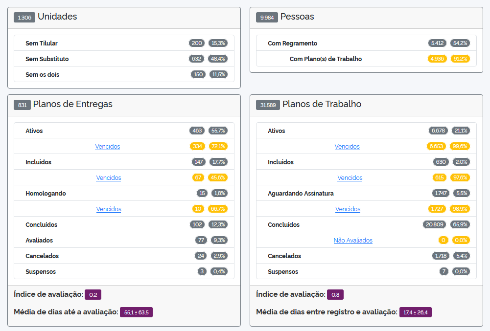
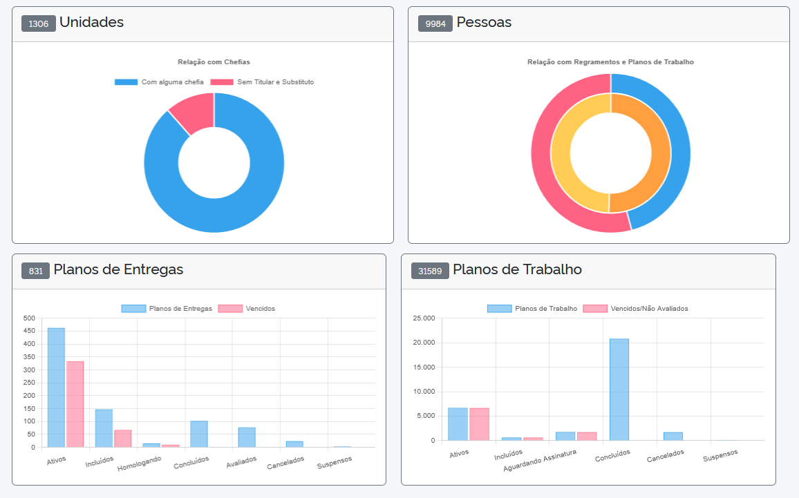

# ApoioPet 1.0 - Consultas ao banco de dados do PGD Petrvs

A imagem docker está disponível em https://hub.docker.com/r/cimei/apoiopet

Caso encontre alguma discrepância entre os dados deste sitema e o encontrado no 
PGD Petrvs de sua instituição, me avise que eu irei buscar a correção.

**Mapa Estratégico**

- Nome, missão, visão, resultados, objetivos por eixo temático e valores

**Planos de entregas** 

  - Listagem de todos os PEs cadastrados contendo:
    * Quantidade total de PEs cadastrados
     * geral
    * unidade
    * status
    * inicio e fim
    * quantas e quais entregas estão vinculadas
    * quantos e quais planos de trabalho estão vinculados
    * se foi avaliado e qual a avaliação
 
 - Informações das Entregas
  * nome,
  * descrição,
  * vigência,
  * tipo de meta,
  * demandante e
  * destinatário

**Plano de trabalho**   

 - Listagem de todos os PTs cadastrados contendo:
    * Quantidade total de PTs cadastrados (geral)
    * unidade
    * nome do participante
    * situação
    * inicio e fim
    * modalidade do plano de trabalho (forma)
    * quantidade do %CHD total
    * se foi avaliado e qual a avaliação
    * detalhamento dos trabalhos

**Pessoas**

* Nome  
* Data nascimento
* Matrícula
* E-mail
* Perfil (Participante, Unidade, etc.)
* Situação
* Unidade de lotação
* Quantos e quais planos de trabalho a pessoa está vinculada
* Quantos e quais regramentos aos quais a pessoa está vinculada

**Unidades**

 * Sigla
 * Nome
 * Código
 * UF
 * Unidade Pai
 * Titular
 * Substituto
 * Delegado

**Envios mal sucedidos**

 * Planos de entregas
 * Planos de trabalho
 * Participantes

**Dados Agregados**

 * Números
 * Gráficos

**Intervenções**

 * Verificar e atualizar Pessoa (BETA)

 Esta função deve ser utilizada em último caso, quando as cargas SIAPE do PGD Petrvs não conseguirem equiparar os dados
 de uma pessoa no SIAPE com o constante na base de dados do sistema.
 Ao se informar um CPF, são trazidos os dados disponíveis nas tabelas de integração (dados brutos do SIAPE) e os correspondentes
 nas tabelas usuarios e unidades do sistema.
 Pode-se então comparar e identificar discrepâncias.
 Ao se clicar no botão "Ajustar", os dados de e-mail, participação no PGD, modalidade no PGD, lotação e chefia serão atualizados 
 na base do PGD Petrvs conforme o que estiver estipulado nos dados do SIAPE. Caso a pessoa não exista na base do sistema, será inserida.
 Use esta função somente após ter tentado a carga invidual do respectivo CPF via PGD Petrvs
 
**Algumas telas do sistema**
 
 * Tela inicial
 

 * Números

 * Gráficos

...
